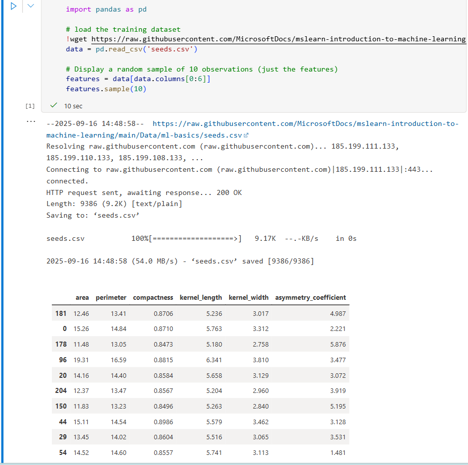
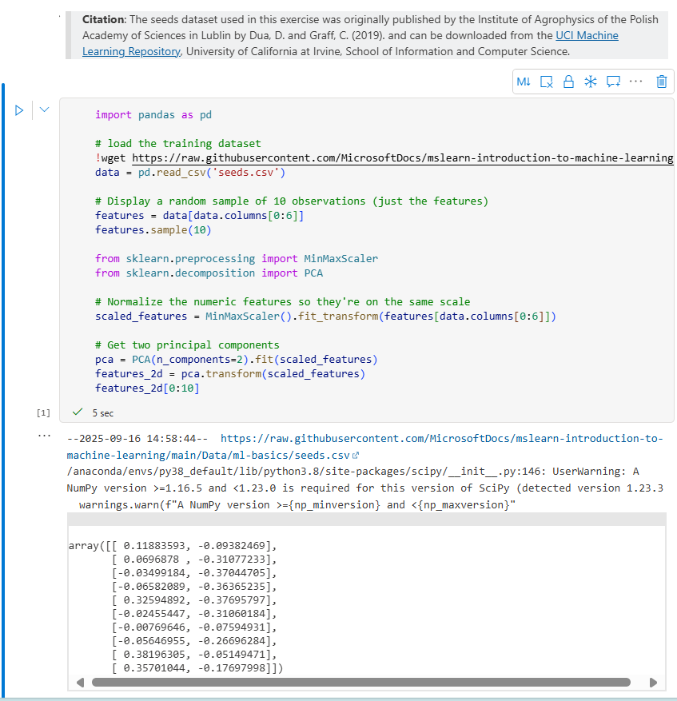

# kmeansc 🌼🌷🌻
kmeansc : K-Means Clustering # scikit-learn framework # clustering model

## Objective
- Learn when to use clustering
- To train and evaluate a clustering model using the scikit-learn framework
- Leverage basic mathematical & statistical concepts

## Train & Evaluate Clustering Models

